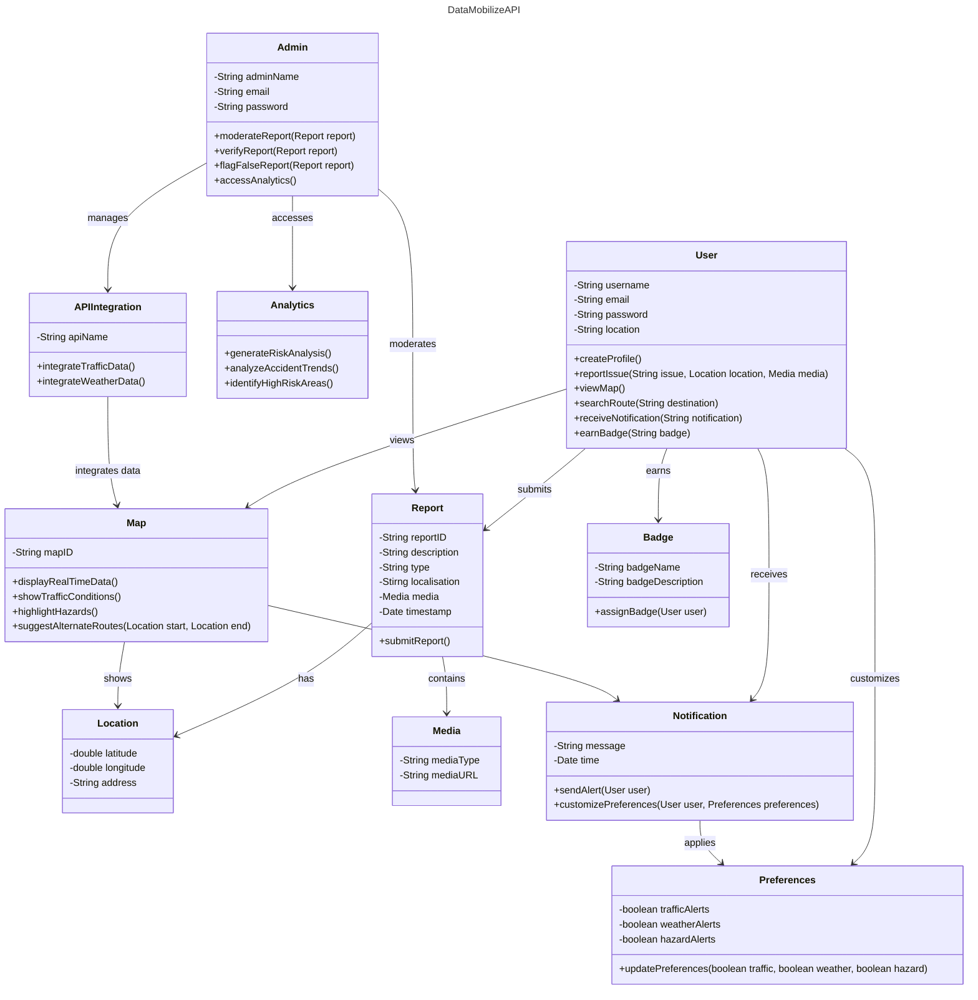

```mermaid
---
title: DataMobilizeAPI
---
classDiagram
    class User {
        -String username
        -String email
        -String password
        -String location
        +createProfile()
        +reportIssue(String issue, Location location, Media media)
        +viewMap()
        +searchRoute(String destination)
        +receiveNotification(String notification)
        +earnBadge(String badge)
    }

    class Admin {
        -String adminName
        -String email
        -String password
        +moderateReport(Report report)
        +verifyReport(Report report)
        +flagFalseReport(Report report)
        +accessAnalytics()
    }

    class Report {
        -String reportID
        -String description
        -String type
        -Stirng localisation
        -Media media
        -Date timestamp
        +submitReport()
    }

    class Location {
        -double latitude
        -double longitude
        -String address
    }

    class Media {
        -String mediaType
        -String mediaURL
    }

    class Notification {
        -String message
        -Date time
        +sendAlert(User user)
        +customizePreferences(User user, Preferences preferences)
    }

    class Preferences {
        -boolean trafficAlerts
        -boolean weatherAlerts
        -boolean hazardAlerts
        +updatePreferences(boolean traffic, boolean weather, boolean hazard)
    }

    class Map {
        -String mapID
        +displayRealTimeData()
        +showTrafficConditions()
        +highlightHazards()
        +suggestAlternateRoutes(Location start, Location end)
    }

    class Badge {
        -String badgeName
        -String badgeDescription
        +assignBadge(User user)
    }

    class Analytics {
        +generateRiskAnalysis()
        +analyzeAccidentTrends()
        +identifyHighRiskAreas()
    }

    class APIIntegration {
        -String apiName
        +integrateTrafficData()
        +integrateWeatherData()
    }

    User --> Report : submits
    User --> Notification : receives
    User --> Map : views
    User --> Badge : earns
    User --> Preferences : customizes

    Admin --> Report : moderates
    Admin --> Analytics : accesses

    Report --> Location : has
    Report --> Media : contains

    Notification --> Preferences : applies

    Map --> Location : shows
    Map --> Notification : triggers

    APIIntegration --> Map : integrates data

    Admin --> APIIntegration : manages
```
